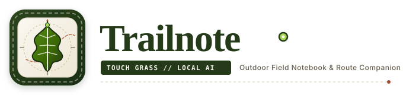

<p align="center">
  
</p>

<p align="center">
  <strong>"Plan the walk. Make the note. Put the phone away."</strong><br>
  <em>A local-first outdoor field notebook & topographic companion powered by Gemma 2.</em><br>
  <strong>Hacktoberfest 2026 — Open-Source AI Challenge Week 1: TOUCH GRASS</strong>
</p>

<p align="center">
  <a href="https://opensource.org/licenses/MIT"></a>
  <a href="https://hacktoberfest.com"></a>
  <a href="https://ollama.com/library/gemma2"></a>
  <a href="https://nextjs.org"></a>
  <a href="https://www.typescriptlang.org"></a>
  <a href="https://leafletjs.com"></a>
  
  
</p>

---

## 🍂 Table of Contents

1. [The "Touch Grass" Manifesto](#-the-touch-grass-manifesto)
2. [Architectural Division of Labor](#-architectural-division-of-labor)
3. [System Architecture & Data Flows](#-system-architecture--data-flows)
4. [Deep Feature Tour](#-deep-feature-tour)
   - [Outdoor Trail Permit (`/plan`)](#1-outdoor-trail-permit-plan)
   - [Topographic Trail Guide (`/trail`)](#2-topographic-trail-guide-trail)
   - [Handheld Trail Card (`/trail-card`)](#3-handheld-trail-card-trail-card)
   - [Sunlight Walk Mode (`/walk`)](#4-sunlight-walk-mode-walk)
   - [Post-Walk Field Notes (`/field-notes`)](#5-post-walk-field-notes-field-notes)
   - [Naturalist Field Journal (`/journal`)](#6-naturalist-field-journal-journal)
   - [Settings & Cache Manager (`/settings`)](#7-settings--cache-manager-settings)
5. [Open-Source Ecology](#-open-source-ecology)
6. [API & Route Reference](#-api--route-reference)
7. [Directory Structure](#-directory-structure)
8. [Hardware & Quickstart Guide](#-hardware--quickstart-guide)
9. [Design System & Aesthetics](#-design-system--aesthetics)
10. [Resilience & Fallback Matrix](#-resilience--fallback-matrix)
11. [Verification & Quality Gates](#-verification--quality-gates)
12. [Contributing](#-contributing)
13. [License](#-license)

---

## 🌾 The "Touch Grass" Manifesto

Modern hiking and outdoor fitness software has engineered a tragic paradox: **to experience the natural world, users are chained to a glowing glass screen**.
- Turn-by-turn chimes disrupt birdsong.
- Aggressive background GPS polling drains device batteries in remote terrain.
- Social feeds, leaderboards, and gamified badges turn quiet forest contemplation into a dopamine metric.

```
TRADITIONAL OUTDOOR APPS (SCREEN-LOCKED LOOP):
   [Unlock Phone] ──► [Check Pace] ──► [Notifications] ──► [Map Chime] ──► [Battery Dies]
   
TRAILNOTE INVERSION (TOUCH GRASS PARADIGM):
   ┌──────────────┐         ┌──────────────┐         ┌──────────────┐
   │  < 3 MINUTES │         │   HANDHELD   │         │   HOURS OF   │
   │  Plan Trail  │  ───►   │  Trail Card  │  ───►   │ Screen-Free  │
   │   with AI    │         │  (Print/Txt) │         │ Exploration  │
   └──────────────┘         └──────────────┘         └──────────────┘
```

**Trailnote is built on a single, uncompromising principle:**  
*The screen should be the shortest part of the walk.*

1. **Plan before you depart (< 3 mins)**: Enter your location, available walking time, pace, and natural curiosity.
2. **Hold the physical card in your hand**: Print an elegant, high-contrast monochrome **Trail Card** with offline topographic contours, waypoints, and ruled lines for your pencil notes.
3. **Put the phone in your pack**: Step onto the trail, feel the autumn breeze, listen to the canopy, and touch grass.
4. **Log your observations when you return**: Jot down sensory memories. If desired, let local **Gemma 2** shape your notes in the reflective voice of Scottish naturalist Nan Shepherd.

---

## 🧭 Architectural Division of Labor

A pervasive design flaw in contemporary "AI applications" is **hallucination creep**: asking a large language model to guess coordinates, compute mountain distances, or invent weather forecasts.

Trailnote enforces a strict mathematical **Division of Labor**:

```
        ┌────────────────────────────────────────────────────────┐
        │                 DETERMINISTIC ENGINES                  │
        │          (Real-World Physics & Public Goods)           │
        ├────────────────────────────┬───────────────────────────┤
        │ • Coordinates & Search     │ OpenStreetMap Nominatim   │
        │ • Route Geometry & Contours│ Project-OSRM Foot Engine  │
        │ • Trail Distance & Climb   │ Geodesic Pace & Elevation │
        │ • Atmospheric Conditions   │ Open-Meteo Weather API    │
        │ • Route Map Display        │ Leaflet Cartography       │
        └────────────────────────────┴───────────────────────────┘
                                      │ Verified Physical Context
                                      ▼
        ┌────────────────────────────────────────────────────────┐
        │                 LOCAL GENERATIVE AI                    │
        │               (Google Gemma 2 Weights)                 │
        ├────────────────────────────────────────────────────────┤
        │ • Evocative Trail Briefing & Quieter Dirt Branches     │
        │ • 3 Sensory Engagement Prompts (Sight, Sound, Texture)  │
        │ • Packing Guidance & Terrain Footing Cautions          │
        │ • Post-Walk Journal Prose (Nan Shepherd / John Muir)   │
        └────────────────────────────────────────────────────────┘
```

| Domain | Responsible Engine | Engineering Rationale |
| :--- | :--- | :--- |
| **Geocoding & Autocomplete** | **OpenStreetMap Nominatim** | Real-world trailheads; zero fabricated latitude/longitude pairs. |
| **Foot Routing & Distance** | **OSRM (Project-OSRM)** | Exact footpath coordinates, geodesic kilometer calculation, and elevation profiles. |
| **Weather & Atmosphere** | **Open-Meteo** | Live temperature, wind velocity, precipitation probability, and weather codes. |
| **Sensory Naturalist Prompts** | **Gemma 2 (via Ollama)** | Metaphorical, lyrical, and educational observation tasks tailored to seasonal flora. |
| **Journal Prose Refinement** | **Gemma 2 (via Ollama)** | Transforms raw human field fragments into evocative outdoor literature. |
| **Offline Fallback Guarantee** | **Deterministic Fallback Engine** | 100% uptime: if Ollama is paused or uninstalled, pre-authored naturalist logic activates silently. |

---

## 🏛️ System Architecture & Data Flows

Trailnote operates on a **Local-First, Zero-Cloud** architecture. All data remains strictly sandboxed within the user's browser disk (`localStorage`) and local machine.

```
┌───────────────────────────────────────────────────────────────────────────────┐
│                           CLIENT BROWSER ENVIRONMENT                          │
│                                                                               │
│  ┌────────────────┐     ┌──────────────────┐     ┌────────────────────────┐   │
│  │ Next.js 15 App │     │  Leaflet Paper   │     │  Browser Geolocation   │   │
│  │   Components   │◄───►│    Cartography   │◄───►│    Accuracy (~12m)     │   │
│  └───────┬────────┘     └──────────────────┘     └────────────────────────┘   │
│          │                                                                    │
│          ▼                                                                    │
│  ┌─────────────────────────────────────────────────────────────────────────┐  │
│  │                     OFFLINE LOCALSTORAGE PERSISTENCE                    │  │
│  │  trailnote_active_plan · trailnote_cards · trailnote_journal_entries   │  │
│  │  trailnote_settings    · trailnote_device_loc · trailnote_trail_loc     │  │
│  └─────────────────────────────────────────────────────────────────────────┘  │
└──────────────────────────────────────┬────────────────────────────────────────┘
                                       │ Internal API Requests
                                       ▼
┌───────────────────────────────────────────────────────────────────────────────┐
│                         NEXT.JS API SERVER ROUTE LAYER                        │
│                                                                               │
│   /api/generate-trail   /api/search-location   /api/reverse-geocode           │
│   /api/shape-note       /api/health                                           │
└──────────┬───────────────────────────┬───────────────────────────┬────────────┘
           │                           │                           │
           ▼                           ▼                           ▼
┌──────────────────────┐   ┌───────────────────────┐   ┌───────────────────────┐
│     LOCAL GEMMA 2    │   │     OPENSTREETMAP     │   │      OPEN-METEO       │
│     (Ollama API)     │   │   Nominatim + OSRM    │   │    Atmospheric WX     │
│   localhost:11434    │   │   1 req/sec Throttle  │   │     Free Open API     │
└──────────────────────┘   └───────────────────────┘   └───────────────────────┘
```

### Physical Location Separation: Device vs. Trailhead
Trailnote maintains **two independent coordinate models** across the application lifecycle:
- **`deviceLocation`**: The physical GPS coordinates of the user's device (`{ lat, lng, accuracyM, timestamp }`) acquired via `navigator.geolocation.getCurrentPosition`. Used solely for the *"● YOU ARE HERE"* map indicator and distance-to-trailhead calculation.
- **`trailLocation`**: The intended hiking location selected via search or field preset (`{ lat, lng, displayName, city, state }`).

> **Architectural Guarantee**: A walker sitting at their office desk in downtown Manhattan can plan an afternoon mountain loop in the Hudson Valley without the trail snapping to their office.

---

## 🎒 Deep Feature Tour

### 1. Outdoor Trail Permit (`/plan`)
The trailhead planning interface is styled as a physical national park field permit:
- **Worldwide Location Search**: Real-time autocomplete search querying OpenStreetMap Nominatim. Enforces an asynchronous **1 request/sec rate throttle** with dual-tier in-memory TTL caching.
- **Native Browser Pinpoint**: Single-invocation GPS pinpoint displaying accuracy radius in meters (`Accurate to ~12 m`).
- **Expedition Presets**: Instant templates for *Autumn Canopy Loop*, *Morning Field Stroll*, and *Rugged Ridge Hike*.
- **Curiosity Toggles**: Fine-tune observation prompts for *Foliage & Leaf Shapes*, *Birdsong Soundscapes*, *Basalt & Soil Geology*, *Ancient Tree Canopies*, or *Silent Solitude*.

### 2. Topographic Trail Guide (`/trail`)
Organized according to a strict outdoor safety information hierarchy:
- **Vital Metrics Grid**: Distance (km/mi), estimated walking duration based on configured user pace, trail difficulty grade (`EASY`, `MODERATE`, `CHALLENGING`), and calculated elevation climb.
- **Paper Trail Leaflet Map**:
  - Deep spruce polyline casing with an animated moss green trail dash (`.trail-flow-dash`).
  - Labeled waypoint pins: Start (`S`), Waypoints (`01-04`), Finish (`F`).
  - Tactile **`[ ⌖ RECENTER TRAIL ]`** button to smoothly animate the map back to the full route bounds.
  - Physical metric/imperial scale bar (`L.control.scale`).
  - **Inline Topographic Elevation Profile SVG**: Vector mountain elevation chart rendering altitude climb and peak crest.
- **Atmospheric Readings**: Verified Open-Meteo wind speed, temperature, and cloud cover.
- **Naturalist Briefing**: Local Gemma 2 advisory highlighting quieter dirt branches and canopy viewpoints.
- **Field Gear Checklist & Safety Advisory**: Pack essentials and footing cautions (wet leaves, early dusk).

### 3. Handheld Trail Card (`/trail-card`)
A tactile physical artifact designed to be carried in a pocket:
- **100% Offline Vector Route Snapshot**: An inline SVG route contour generated with compass rose, cardinal coordinates, waypoints, and scale bar. **Renders and prints with zero internet map tiles required**.
- **Ruled Notebook Section**: High-contrast lined paper section for physical pencil notes in the field.
- **Plain-Text Export**: One-click `.txt` file download formatted for low-power e-ink readers.
- **Dedicated A4 Print Stylesheet**: Built-in CSS hides navigation, buttons, and backgrounds to produce a crisp, ink-friendly monochrome printout.

### 4. Sunlight Walk Mode (`/walk`)
- **High-Contrast Outdoor Screen**: Maximum legibility in harsh direct outdoor sunlight.
- **Sensory Observation Checklist**: Quick interactive checkboxes: `[ Mark Observed ]`.
- **Deliberate Reminder**: A prominent tactile button: `[ PUT PHONE AWAY ]`.

### 5. Post-Walk Field Notes (`/field-notes`)
- **Sensory Perception Fields**: Structured inputs for *What did you see?* (Sight), *What did you hear?* (Sound), *What did you touch?* (Texture), and *Favorite Moment*.
- **Local Photo Sandbox**: Local image upload via HTML5 `FileReader` converting photos to sandboxed base64 strings. **Zero bytes ever touch an external cloud server**.

### 6. Naturalist Field Journal (`/journal`)
- **Polaroid Photo Cards**: Displays your field observations alongside attached photo snapshots.
- **Strict Separation of Human vs. AI Writing**:
  - `ORIGINAL NOTE`: The walker's authentic field words preserved without modification.
  - `AI FIELD NOTE // NATURALIST PROSE`: Lyrical narrative prose generated by Gemma 2.
- **`[ SHAPE THIS NOTE ]`**: Calls `POST /api/shape-note` to interpret your raw notes in the literary style of Scottish mountaineer Nan Shepherd (*The Living Mountain*) or John Muir.

### 7. Settings & Cache Manager (`/settings`)
- **Walking Pace Calibration**: Slider from 2.5 km/h to 5.5 km/h with instant travel time recalculation.
- **Measurement Units**: Toggle between Metric (Kilometers / Meters) and Imperial (Miles / Feet).
- **Local AI Diagnostic**: Ping test measuring latency to Ollama Gemma 2 (`http://localhost:11434`).
- **Offline Cache Manager**: Inspect byte usage and clear localStorage caches with one click.

---

## 🌐 Open-Source Ecology

Trailnote is constructed entirely from open-weights models, open standards, and community-funded public goods:

```
                  ┌────────────────────────────────────────┐
                  │               TRAILNOTE                │
                  │       Next.js 15 + React 19 + TS       │
                  └───────────────────┬────────────────────┘
         ┌────────────────────────────┼────────────────────────────┐
         ▼                            ▼                            ▼
┌──────────────────┐       ┌──────────────────────┐       ┌──────────────────┐
│     GEMMA 2      │       │    OPENSTREETMAP     │       │    OPEN-METEO    │
│  Google Weights  │       │  Nominatim Geocoding │       │  Free Weather    │
│  2B / 9B Models  │       │  Project-OSRM Engine │       │  Zero API Keys   │
└──────────────────┘       └──────────────────────┘       └──────────────────┘
```

1. **Gemma 2 (2B / 9B)**: Google's open-weights model run locally on personal hardware via Ollama.
2. **OpenStreetMap Nominatim**: Community-maintained global geographic database.
3. **Project-OSRM**: High-performance open-source routing engine for pedestrian footpath networks.
4. **Open-Meteo**: Free weather API delivering open numerical weather prediction (NWP) model data without commercial keys.
5. **Leaflet**: Lightweight, accessible open-source cartographic visualization.

---

## 🔌 API & Route Reference

### `GET /api/health`
Checks whether local Gemma 2 is accessible via Ollama.
```json
// Response: 200 OK
{
  "status": "ready",
  "isAvailable": true,
  "model": "gemma2:2b",
  "provider": "ollama"
}
```

### `GET /api/search-location`
Rate-throttled OpenStreetMap geocoding endpoint.
- **Query Params**: `q` (string, required), `limit` (number, default: 5)
```json
// Response: 200 OK
[
  {
    "displayName": "Prospect Park, Brooklyn, Kings County, New York, United States",
    "lat": 40.6602,
    "lng": -73.9690,
    "city": "New York",
    "state": "New York",
    "country": "United States"
  }
]
```

### `POST /api/generate-trail`
Generates a complete, verified trail expedition plan.
- **Request Body**:
```json
{
  "location": "Prospect Park, Brooklyn",
  "lat": 40.6602,
  "lng": -73.9690,
  "durationMin": 60,
  "difficulty": "moderate",
  "curiosity": "foliage",
  "paceKmh": 4.0
}
```
- **Response**: Returns a full `TrailPlan` object containing geodesic waypoints, OSRM distance, elevation gain, Open-Meteo weather readings, and Gemma 2 naturalist guidance.

### `POST /api/shape-note`
Refines raw human field observations into lyrical outdoor prose.
- **Request Body**:
```json
{
  "notes": {
    "sight": "Golden birch leaves falling like coins",
    "sound": "Creek murmuring over mossy slate",
    "texture": "Damp hemlock bark, cold wind",
    "favoriteMoment": "Sitting on the glacial boulder in silence"
  },
  "trailName": "Prospect Park Ridge Loop"
}
```
- **Response**:
```json
{
  "shapedNote": "The birch shedding gold against the damp slate—a quiet reminder that autumn does not mourn what it lets go. In the hemlock shade, the wind spoke only of stillness."
}
```

---

## 📂 Directory Structure

```
TrailNote/
├── public/
│   ├── images/
│   │   ├── trailnote-logo.svg      # Master horizontal brand banner
│   │   ├── trailnote-icon.svg      # High-res 512x512 squircle icon
│   │   └── autumn_trail_hero.jpg   # Warm natural hero plate
│   ├── icon.svg                    # Browser favicon & webclip
│   ├── logo.svg                    # Scalable brand vector
│   └── manifest.json               # Progressive Web App manifest
├── src/
│   ├── app/
│   │   ├── api/
│   │   │   ├── generate-trail/     # Trail generation pipeline & OSRM
│   │   │   ├── health/             # Ollama health diagnostic
│   │   │   ├── reverse-geocode/    # Lat/lng to locality resolver
│   │   │   ├── search-location/    # Throttled Nominatim search
│   │   │   └── shape-note/         # Gemma 2 Nan Shepherd prose engine
│   │   ├── field-notes/            # Post-walk sensory logging page
│   │   ├── journal/                # Outdoor field journal & polaroid cards
│   │   ├── plan/                   # Trail permit & location search page
│   │   ├── settings/               # Hardware calibration & cache manager
│   │   ├── trail/                  # Topographic guide & Leaflet map page
│   │   ├── trail-card/             # Handheld printable A4 card page
│   │   ├── walk/                   # Sunlight walk mode screen
│   │   ├── layout.tsx              # Root HTML shell & metadata
│   │   └── page.tsx                # Editorial landing page
│   ├── components/
│   │   ├── layout/
│   │   │   ├── Navigation.tsx      # Responsive navigation & AI beacon
│   │   │   └── Footer.tsx          # Touch grass naturalist footer
│   │   ├── map/
│   │   │   ├── PaperTrailMap.tsx   # Leaflet map with animated flow dash
│   │   │   └── TopoElevation.tsx   # Inline vector mountain chart
│   │   └── ui/
│   │       ├── LeafDecoration.tsx  # 8 bespoke botanical SVG foliage marks
│   │       ├── DifficultyBadge.tsx # Tactile trail difficulty stamp
│   │       ├── DistanceBlock.tsx   # Metric / imperial distance block
│   │       └── CompassMark.tsx     # Vintage orientation seal
│   ├── lib/
│   │   ├── ai/
│   │   │   ├── gemma-client.ts     # Ollama API client & prompt engineer
│   │   │   └── fallback-prompts.ts # Deterministic offline naturalist logic
│   │   ├── maps/
│   │   │   ├── nominatim.ts        # 1 req/sec throttled OSM geocoding
│   │   │   ├── osrm.ts             # Geodesic loop & footpath routing
│   │   │   └── weather.ts          # Open-Meteo atmospheric forecasts
│   │   ├── storage/
│   │   │   └── offline-store.ts    # Type-safe browser localStorage sandbox
│   │   └── types/
│   │       └── index.ts            # Core TypeScript interfaces & schemas
│   └── styles/
│       └── globals.css             # Spacing tokens, paper palette & print CSS
├── ARCHITECTURE.md                 # Deep technical architecture documentation
├── DEV_POST.md                     # Publish-ready DEV.to article
├── DEMO_SCRIPT.md                  # 90-second video demo walkthrough
├── README.md                       # Comprehensive project master guide
└── package.json                    # Dependencies & scripts
```

---

## 💻 Hardware & Quickstart Guide

### System Requirements
| Component | Minimum Specification | Recommended Specification |
| :--- | :--- | :--- |
| **Node.js** | v18.18+ | v20.x or v22.x LTS |
| **RAM** | 4 GB (without local AI) | 8 GB – 16 GB |
| **Local AI Engine** | Ollama (optional) | Ollama running `gemma2:2b` |
| **GPU / VRAM** | CPU Mode (any modern chip) | 4 GB+ VRAM (NVIDIA / Apple Silicon) |

### 1. Clone & Install
```bash
git clone https://github.com/your-username/trailnote.git
cd trailnote
npm install
```

### 2. Configure Environment
```bash
cp .env.example .env.local
```

Verify your `.env.local`:
```ini
# Local Gemma 2 via Ollama
OLLAMA_BASE_URL=http://localhost:11434
OLLAMA_MODEL=gemma2:2b

# OpenStreetMap Nominatim (Rate-throttled at 1 req/sec)
NOMINATIM_BASE_URL=https://nominatim.openstreetmap.org
NOMINATIM_USER_AGENT=Trailnote/1.0 (Hacktoberfest-TouchGrass; trailnote@local.dev)

# Project-OSRM Foot Engine
OSRM_BASE_URL=https://router.project-osrm.org

# Open-Meteo Atmospheric Forecast
OPEN_METEO_BASE_URL=https://api.open-meteo.com/v1/forecast
```

### 3. Optional: Run Gemma 2 Locally
If you have [Ollama](https://ollama.com) installed:
```bash
ollama pull gemma2:2b
ollama serve
```
*(If Ollama is not installed or running, Trailnote automatically uses its built-in deterministic naturalist fallback engine. You will never encounter a crash).*

### 4. Launch Development Server
```bash
npm run dev
```
Open **[http://localhost:3000](http://localhost:3000)**.

---

## 🎨 Design System & Aesthetics

Trailnote's visual identity rejects standard high-tech SaaS tropes (no purple gradients, no glowing orbs, no glassmorphism). Instead, it draws inspiration from **19th-century naturalist field journals, national park paper permits, and autumn foliage**:

### Color Palette
| Token | Value | Visual Purpose |
| :--- | :--- | :--- |
| `--paper-bg` | `#F4F0E4` | Base textured natural paper background |
| `--paper-card` | `#FAF7F0` | High-contrast tactile paper notebook cards |
| `--paper-warm` | `#EDE7D5` | Recessed parchment containers & inputs |
| `--green-deep` | `#243A18` | Deep pine foundation & high-contrast titles |
| `--green-leaf` | `#3A6704` | Organic forest foliage accent & buttons |
| `--green-olive`| `#709F2D` | Active trail route casing & verified stamps |
| `--autumn-rust`| `#A64B2A` | Maple waypoint markers, alerts & compass stars |
| `--autumn-ochre`|`#878118` | Secondary contour rings & brass rules |
| `--neon-accent`| `#A4D652` | Living grass status beacon (**Theme: Touch Grass**) |

### Typography Pairing
- **`Fraunces`**: Optical-size variable serif used for literary headings, titles, and reflective quotes.
- **`Inter`**: Highly legible geometric sans-serif for metrics, trail directions, and checklists.
- **`JetBrains Mono`**: Monospaced font for coordinates, GPS accuracy, and field stamps.

### Botanical Foliage Motifs
Built with **8 custom scalable SVG botanical marks** (`src/components/ui/LeafDecoration.tsx`):
- `maple`: Sugar maple leaf (Hero plate & Signature Trail Card)
- `oak`: English oak leaf (Field Journal entries)
- `fern`: Forest fern frond (Trail Permit form & Field Notes)
- `pine`: White pine needles (Topographic Trail Guide)
- `grass`: Wild blades of prairie grass (Walk Mode & Empty States)
- `acorn`: Tactile botanical field seal stamp
- `birch`: Slender paper birch leaf
- `pressed-leaf`: Herbarium specimen mark

---

## 🛡️ Resilience & Fallback Matrix

| Scenario | System Behavior | User Experience |
| :--- | :--- | :--- |
| **Ollama is offline or paused** | API catches network timeout (`ECONNREFUSED`); triggers `src/lib/ai/fallback-prompts.ts`. | User receives instant, beautifully written Scottish naturalist notes and guidance without error screens. |
| **Nominatim is slow or throttled** | Async throttle enforces `1 req/sec`; in-memory `Map` returns cached search query immediately. | Fast autocomplete suggestions; compliant with OpenStreetMap usage policy. |
| **Device is completely offline (Airplane Mode)** | Printable Trail Card (`/trail-card`) uses 100% inline SVG route snapshots; local storage preserves data. | Walker views route contours, waypoints, and takes notes with zero internet connection. |
| **Geolocation permission denied** | Gracefully handles denied prompt; allows manual trailhead search or preset selection. | Zero unhandled promise rejections; clear notification message. |

---

## 🧪 Verification & Quality Gates

The codebase passes strict automated validation gates:

```bash
# 1. ESLint Check (0 errors, 0 warnings)
npm run lint

# 2. Strict TypeScript Compilation Check (0 type errors)
npx tsc --noEmit

# 3. Offline Logic & Model Diagnostic Test
npm test

# 4. Production Next.js 15 Build & Route Optimization
npm run build
```

---

## 🤝 Contributing

Contributions from naturalists, outdoor enthusiasts, and open-source developers are welcome!

1. Fork the repository.
2. Create a topic branch: `git checkout -b feature/lichen-identification-prompts`.
3. Ensure code adheres to strict TypeScript standards: `npx tsc --noEmit && npm run lint`.
4. Commit your changes: `git commit -m "feat: add lichen sensory curiosity prompts"`.
5. Push to your branch and open a Pull Request.

---

## 📄 License

Distributed under the **MIT License**. See `LICENSE` for details.

---

<p align="center">
  <em>"The earth is not a platform for computation, but a living body to be walked upon."</em><br>
  <strong>Put the phone away. Touch grass today.</strong> 🥾🌲
</p>
